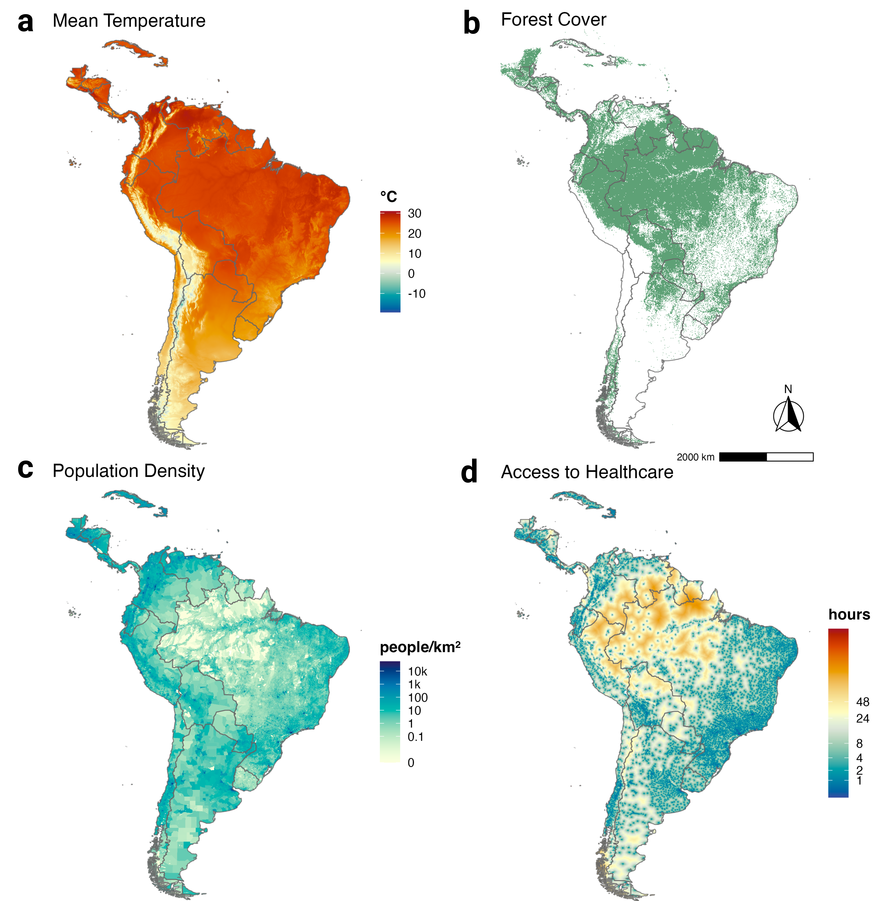

## Hi there 👋

I'm Sam. I enjoy bringing together large environmental & health data sets and building statistical models (see [global_tbv](https://github.com/sbsambado/global_tbvs) or [wnv_USdrivers](https://github.com/sbsambado/wnv_USdrivers)). I also enjoy teaching students who are new to biostats & coding (see [Biometry_HOTgrant](https://github.com/sbsambado/Biometry_HOTgrant)). Most of what I do is in R. I'm always looking to improve my maps.

Contact Info:
- Email: sbsambado@gmail.com  / ssambado@stanford.edu
- ORCID: [0000-0002-2594-3641]  
- [Personal website](https://samsambado.weebly.com/)

<!--
**sbsambado/sbsambado** is a ✨ _special_ ✨ repository because its `README.md` (this file) appears on your GitHub profile.

Here are some ideas to get you started:

- 🔭 I’m currently working on ...
- 🌱 I’m currently learning ...
- 👯 I’m looking to collaborate on ...
- 🤔 I’m looking for help with ...
- 💬 Ask me about ...
- 📫 How to reach me: ...
- 😄 Pronouns: ...
- ⚡ Fun fact: ...
-->
